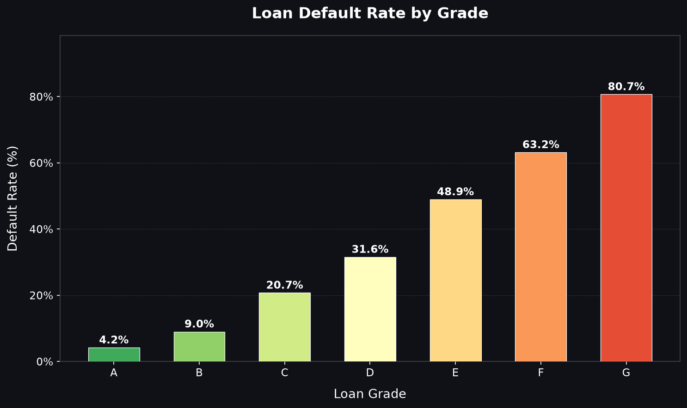
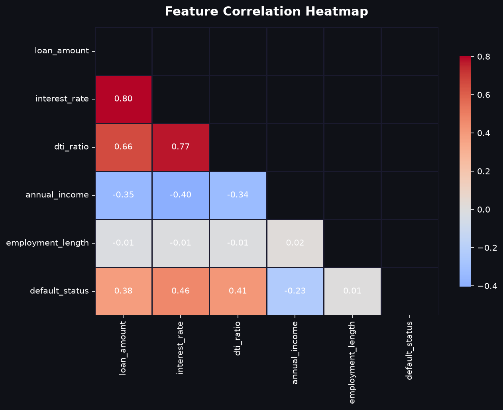

# Financial Risk & Loan Default Analysis — Summary Report

> **Dataset**: 5,000 synthetic loan records | **Analysis Date**: 2026-09-30

---

## 1. Executive Summary

| Metric | Value |
|--------|-------|
| Total Loans Analysed | 5,000 |
| Total Defaults | 1,235 |
| Overall Default Rate | **24.70%** |
| Highest-Risk Grade | **G** (80.7% default rate) |
| Lowest-Risk Grade | **A** (4.2% default rate) |

---

## 2. Key Risk Drivers

### Top Features Correlated with Default

| Feature | Pearson r | Interpretation |
|---------|-----------|----------------|
| interest_rate | +0.463 | Positive — increases risk |
| dti_ratio | +0.409 | Positive — increases risk |
| loan_amount | +0.385 | Positive — increases risk |

### Defaulters vs Non-Defaulters — Average Comparison

| Feature | Defaulted | Did Not Default | Delta |
|---------|-----------|-----------------|-------|
| Interest Rate | 17.21% | 10.74% | +6.47% |
| DTI Ratio | 0.276 | 0.182 | +0.094 |
| Annual Income | $51,616 | $62,042 | $-10,426 |

> **Finding**: Defaulters carry **higher interest rates**, **higher DTI ratios**, and **lower annual incomes** on average.

---

## 3. Default Rate by Loan Grade

| Grade | Total Loans | Defaults | Default Rate |
|-------|-------------|----------|--------------|
| A | 1,029 | 43 | 4.2% |
| B | 1,112 | 100 | 9.0% |
| C | 960 | 199 | 20.7% |
| D | 805 | 254 | 31.6% |
| E | 615 | 301 | 48.9% |
| F | 277 | 175 | 63.2% |
| G | 202 | 163 | 80.7% |

> **Finding**: Default rates escalate sharply from Grade A to Grade G, confirming that loan grade is the single strongest categorical predictor of default.

---

## 4. Correlation Heatmap

Key observations from the heatmap:
- `interest_rate` and `dti_ratio` show the strongest positive correlations with `default_status`
- `annual_income` shows negative correlation — higher income = lower default risk
- `loan_amount` has only weak correlation with default, suggesting amount alone is not predictive

---

## 5. Risk Recommendations

| # | Recommendation | Rationale |
|---|---------------|-----------|
| 1 | **Cap lending to Grade E–G borrowers** | Default rates above 30%; risk-adjusted return is unfavourable |
| 2 | **Set DTI threshold at 0.40** | Borrowers with DTI > 0.40 show disproportionately higher default rates |
| 3 | **Apply interest rate caps by grade** | High interest rate itself is a stress multiplier on repayment ability |
| 4 | **Require minimum income verification** | Lower income is correlated with default; income floors reduce selection risk |
| 5 | **Monitor 60-month term loans separately** | Longer exposure window increases cumulative default probability |

---

## 6. Data Quality Notes

| Issue | Resolution |
|-------|-----------|
| `dti_ratio` — 400 missing values (~8%) | Imputed with **median** (0.1970) to avoid skew sensitivity |
| `employment_length` — 473 missing values (~9%) | Imputed with **mode** (1 years) as it behaves like a categorical feature |
| Duplicate loan IDs | Checked — none found |
| Outlier rows flagged | Preserved with `is_outlier` flag for downstream model use |

---

*Generated automatically by `03_eda_analysis.py`*
